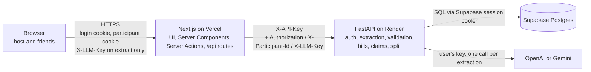

# Split the Bill — Frontend

Next.js app behind **Split the Bill**: a host photographs (or pastes) a restaurant receipt, an LLM of their choice reads it, the host checks the numbers, and friends open a share link to claim what they had. Everyone sees exactly what they owe — tax, service charge, discounts and tip split in proportion to what they ate — and claims show up for everyone within about 3 seconds.

| | |
|---|---|
| Live app | `<vercel-url>` *(filled in after deployment)* |
| API | <https://split-the-bill-api.onrender.com> — interactive docs at [`/docs`](https://split-the-bill-api.onrender.com/docs) |
| Backend repo | <https://github.com/RPSingh0/split-the-bill> |
| AI usage notes | [AI_USAGE.md](AI_USAGE.md) |

---

## Contents

1. [Architecture](#architecture)
2. [Tech stack](#tech-stack)
3. [Running locally](#running-locally)
4. [Environment variables](#environment-variables)
5. [Deploying to Vercel](#deploying-to-vercel)
6. [Routes](#routes)
7. [How it works](#how-it-works)
8. [Design](#design)
9. [Decisions we made](#decisions-we-made)
10. [Known limitations and next steps](#known-limitations-and-next-steps)
11. [Project layout](#project-layout)

---

## Architecture



| Piece | Where | How |
|---|---|---|
| Signup, login, logout | Server | Server Actions call FastAPI and set or clear the `stb_session` cookie |
| Route protection | Server | `proxy.ts` plus a server-side `GET /auth/me` |
| My bills | Server | A Server Component calls `GET /bills` |
| Extract | Browser → route handler | `app/api/extract/route.ts` checks the login cookie and the size limit, then forwards the upload and the `X-LLM-*` headers |
| Review and live checks | Browser | Local state, the `stb:draft` key in `sessionStorage`, `lib/validate.ts` |
| Create bill | Server Action | `POST /bills`; a 422 sends the issues back to the form |
| Bill page, first load | Server Component | Only for the owner or someone with the participant cookie; everyone else gets the name screen **without** a call to the bill API |
| Bill page, live | Browser (SWR) | Polling and claims through the `/api/[...path]` pass-through |
| Join, "Not you?", remove, done, cancel | Server Actions | Call FastAPI; join sets the `stb_p_<slug>` cookie and "Not you?" clears it |

Boundary rules:
- The browser only ever talks to this app. FastAPI is called from server-side code only, through one helper, [`lib/fastapi.ts`](lib/fastapi.ts) (`server-only`), which adds the shared `X-API-Key`.
- `FASTAPI_API_KEY` is a server-only variable, never `NEXT_PUBLIC_`. No LLM key exists in any environment.

---

## Tech stack

| | |
|---|---|
| Framework | Next.js 16 (App Router, TypeScript, Turbopack), React 19 |
| UI | Tailwind CSS v4, shadcn/ui (`base-nova` preset, built on Base UI), lucide icons, sonner toasts |
| Data | SWR for the live bill, zod for checking stored drafts and form input |
| Images | `browser-image-compression` |
| Package manager | npm |

---

## Running locally

You need Node 20.9 or newer (built with Node 24) and a backend to talk to: either the backend repo running locally (`docker compose up` there starts Postgres and the API on port 8000) or the deployed API.

```bash
npm install
cp .env.example .env.local   # then fill it in, see below
npm run dev                  # http://localhost:3000
```

`.env.local` needs a URL and a key **from the same backend**:

| Backend | `FASTAPI_URL` | `FASTAPI_API_KEY` |
|---|---|---|
| Local (backend's `docker compose up`) | `http://localhost:8000` | `dev-only-change-me` |
| Deployed | `https://split-the-bill-api.onrender.com` | the secret set on Render |

A mismatched pair shows up as "Invalid API key" when you try to log in.

Checks: `npm run lint` and `npm run build`. The spec has no frontend tests; see [AI_USAGE.md](AI_USAGE.md) for how the UI was verified.

---

## Environment variables

| Variable | Required | Notes |
|---|---|---|
| `FASTAPI_URL` | Yes | The API's base URL, without a trailing slash |
| `FASTAPI_API_KEY` | Yes | Shared secret, the same value as on Render. Server-only. |

Nothing else. The LLM key is typed into the page by the host and never stored on a server.

---

## Deploying to Vercel

1. **Import** this repo in Vercel. The framework (Next.js), install command (`npm install`) and build command (`npm run build`) are detected automatically; the root directory is the repo root.
2. **Environment variables:** `FASTAPI_URL` = the Render URL, `FASTAPI_API_KEY` = the same secret as on Render.
3. **Function region:** Singapore (`sin1`), in *Settings → Functions*, next to the API on Render.
4. **Smoke test:** open `/login`, sign up, create a bill from pasted text, then open the share link in a private window and join as a friend.

Notes:
- `/api/extract` sets `maxDuration = 60`; an extraction usually takes 5–20 seconds.
- Vercel caps a request body at 4.5 MB, which is why photos are compressed in the browser to under 4 MB before upload.

---

## Routes

| Route | Who | What |
|---|---|---|
| `/` | Anyone | Redirects to `/bills` if logged in, otherwise to `/login` |
| `/login`, `/signup` | Logged out | Username and password forms |
| `/bills` | Host | My bills: merchant, date, grand total, status, number of people, **New bill** |
| `/bills/new` | Host | Step 1, Receipt: provider, key, photo or text, Extract. Step 2, Review: edit, tip, issues, Create. |
| `/b/[slug]` | Host and friends | The name screen, or the bill: claiming, summary and host controls |
| `/api/extract` | Host | Forwards an extraction to FastAPI |
| `/api/[...path]` | Participants and host | Pass-through for the live bill: `GET bills/:slug`, `PUT`/`DELETE bills/:slug/claims/:item_id` only |

---

## How it works

### Host accounts

- Signup and login are Server Actions. The JWT from FastAPI is stored in the `stb_session` cookie: `httpOnly`, `SameSite=Lax`, 7 days, `Secure` in production only (some browsers reject `Secure` cookies on `http://localhost`).
- `proxy.ts` sends requests for `/bills` and `/bills/new` without that cookie to `/login?next=…`. Pages then confirm the user with `GET /auth/me`, and a 401 goes back to `/login`.
- After login, `next` can only be `/bills/new`; anything else goes to `/bills`, so the login form can't be used to redirect somewhere else.

### The LLM key (bring your own)

1. The host picks OpenAI or Gemini and pastes a key. It lives in React state, mirrored to `sessionStorage` under `stb:llm` — never `localStorage`, never a cookie — so a refresh keeps it and closing the tab clears it. **Forget key** removes it.
2. It is sent only with the extract request, in the `X-LLM-Provider` and `X-LLM-Key` headers — never in a URL or a JSON body.
3. `/api/extract` forwards those headers to FastAPI's `/extract` and never logs headers.
4. FastAPI uses it for one call and discards it (see the backend README).

The new-bill screen is loaded in the browser only (`ssr: false`) so the saved key can be read on the first render without a hydration mismatch.

### Reading the receipt

- **Photo:** JPEG, PNG or WebP; a HEIC file gets "Please use a JPEG or PNG photo". It is compressed in the browser to a longest edge of 2000 px at quality 0.85, and must end up under 4 MB. A preview is shown.
- **Pasted text:** up to 10,000 characters, with a counter.
- `/api/extract` rejects requests without the login cookie and files over 4 MB, then forwards the upload. A 401 from FastAPI clears the login cookie.
- Every error code gets a plain message ([`lib/messages.ts`](lib/messages.ts)) — for a quota error it adds that Gemini limits apply per project, not per key. Something that isn't a receipt gets "This doesn't look like a receipt" and no form.

### Review and live checks

The review form edits a **draft** of strings, saved to `sessionStorage` (`stb:draft`) on every change and checked with zod when it's read back ([`lib/draft.ts`](lib/draft.ts)).

[`lib/validate.ts`](lib/validate.ts) runs the rules the spec marks as "Both" on every keystroke, with the **same codes and field paths as the server**:

| Code | Check |
|---|---|
| `NO_ITEMS` | There are no items |
| `FIELD_MISSING` | An item without a name, quantity or amount; a charge without an amount; no total |
| `INVALID_AMOUNT` | Not a valid amount or more than 2 decimals; negative item amounts or unit prices; quantity ≤ 0; total ≤ 0; items adding up to ≤ 0; negative tax or service charge |
| `ITEMS_SUBTOTAL_MISMATCH` | Items don't add up to the subtotal (exact) |
| `TOTAL_MISMATCH` | Subtotal plus charges isn't the total (exact) |
| `DISCOUNT_SIGN` | A discount with a positive amount |
| `TIP_INVALID` | A negative tip, or a tip % outside 0–100 |

Issues from the server are merged like this:
- Only the ones the browser can't reproduce are kept — the server-only warnings (`LINE_MATH`, `TAX_RATE_MISMATCH`, `MODEL_WARNING`, …) and "more than 2 decimals from the LLM".
- Each disappears as soon as its field is edited; adding or deleting a row clears the server issues for that list.
- A 422 from **Create** replaces them with the fresh list.

Errors are red and warnings amber, in a summary banner and on the affected row. **Create** stays disabled while errors remain ("Fix N issues to continue"). Warnings never block.

Money: typed rupees become integer paise with exact string arithmetic in [`lib/money.ts`](lib/money.ts) (no floats); more than 2 decimals is rejected. Amounts are shown with `Intl.NumberFormat('en-IN')`, e.g. ₹1,43,700.00. A tip in % shows its ₹ value using the same half-up rounding as the server, which recomputes it from `tip_percent`.

### Share link and joining

- Before a name is entered, `/b/[slug]` shows only "You've been invited to split a bill" — no merchant, amounts or names. The page doesn't call the bill API for someone with no cookie, and the API itself refuses bill data to non-participants.
- Joining sets `stb_p_<slug>` (the participant id): `httpOnly`, `SameSite=Lax`, 365 days, `Secure` in production.
- If the name is taken: "Priya is already on this bill. Is that you?" — **Yes** joins as that person; **No** pre-fills "Priya " so they can make it "Priya S". The host's own name is refused.
- **Not you?** clears the cookie and shows the name screen again. Someone the host removed sees "You're no longer on this bill".
- Full, settled, cancelled and unknown bills each get a plain message.

### Live updates and claiming

- **Pass-through:** `/api/[...path]` allows only `GET bills/:slug` and `PUT`/`DELETE bills/:slug/claims/:item_id` (everything else is a 404). It adds `X-API-Key`, turns `stb_session` into `Authorization` and `stb_p_<slug>` into `X-Participant-Id`, and forwards no other headers.
- **Polling:** SWR uses the server-rendered bill as its starting data, so there's no loading flash. It polls every 3 seconds with `?since=<version>`; an unchanged bill answers `{changed:false}` and the current data is kept. Polling pauses in a hidden tab, refreshes when the tab gets focus, and stops for good once the bill is settled or cancelled.
- **Claiming:** "I had this" toggles a shared item; a −/+ stepper claims units, capped at what's left. Claims show immediately (SWR optimistic data) and roll back with a toast if the server says no — e.g. "Someone just took it. Only 0 left to claim."
- **Summary:** one row per person plus **Unclaimed**, each opening a breakdown of items, tax, service charge, discount, round off, other charges and tip. A frosted bar at the bottom shows "You owe ₹X".
- **Host controls:** **Copy link** and **Share…** (the phone's share sheet, falling back to copy); **Remove** a friend (with confirmation, their claims go back to Unclaimed); **Mark done**, disabled until Unclaimed is ₹0; **Cancel bill** (with confirmation). Each Server Action returns the new bill view, which goes straight into SWR.
- If the host cancels or settles the bill, or removes someone, the other screens follow on their next poll.

### A sleeping server

Render's free tier sleeps after 15 minutes. Any loading screen or pending form that runs past 5 seconds shows "Waking up the server — the first request can take up to a minute", and a root error boundary offers **Try again**.

---

## Design

- **Mobile first**, because friends open the link on their phones: one column, large touch targets, a sticky "You owe" bar.
- shadcn's neutral palette, with colour only where it means something: green for claimed and settled, amber for warnings, red for errors.
- The system font, fixed-width digits for every amount, tighter tracking on headings.
- Light and dark follow the system, with a matching `theme-color` for the mobile browser bar.
- Small, quick feedback: buttons scale to 0.96 on press, transitions name their properties, the skeleton pulse respects reduced motion, and the frosted bar turns solid for reduced transparency.
- References: Apple's interface guidance, the `better-ui` polish rules and Vercel's Web Interface Guidelines, used while building and when reviewing screenshots of each screen.

---

## Decisions we made

Choices made during the build, beyond or different from the spec:

**Tooling**
- **npm** instead of pnpm.
- shadcn's current default preset (`base-nova`, on Base UI). It brings shadcn's own `cn` package in place of `clsx` + `tailwind-merge`; we checked it is published by shadcn before keeping it.
- No Docker for the frontend: the backend's `docker compose` runs the database and the API, and `npm run dev` talks to it.
- The Vercel function region is set in the dashboard, not in code.

**Behaviour**
- **Expired login:** a Server Component can't delete cookies, so pages simply redirect to `/login` and the next login overwrites the old cookie. The extract route and the create-bill action do clear it on a 401.
- **Server issues on the review screen** are filtered and cleared as described above, so a stale "total doesn't match" can't keep **Create** disabled after the host has fixed it.
- **After Create**, the browser clears the draft and navigates to `/b/{slug}` itself, instead of a server redirect, so `sessionStorage` can be cleared.
- **An unknown bill link** shows the not-found page, but with HTTP 200: the page has a loading screen (for the waking-up notice), so streaming has started before the 404 is known. Next.js marks it `noindex`.
- **Sharing** is host-only: **Copy link**, plus **Share…**, which uses the phone's share sheet and falls back to copying. The link itself isn't printed on the page.
- **Confirmations** only for irreversible, destructive actions: **Remove** and **Cancel bill**. **Mark done** and the review's **Start over** don't ask.
- Toasts appear at the top so they never cover the "You owe" bar.

**Small structural additions:** `lib/draft.ts` (the review draft), `lib/dates.ts`, `lib/messages.ts` (one plain message per error code), `lib/session.ts` (cookies and the current user), `lib/types.ts`, and `app/error.tsx`.

---

## Known limitations and next steps

**Limitations**
- **Trust model:** anyone with the link can join and claim for anyone; only the host can remove people.
- **Live updates** are polling every 3 seconds, not push.
- **Cold starts:** the first request after the API has slept takes up to a minute.
- **The LLM key** sits in `sessionStorage` while the tab is open, so a script running on the page could read it. The app loads no third-party scripts.
- **No automated frontend tests** in the repo (per the spec); the UI was checked with throwaway browser scripts (see AI_USAGE.md).
- An unknown bill link returns HTTP 200 (see above), and **Start over** on the review screen doesn't ask first.
- One receipt per bill, INR only, no PDFs, no QR code, no settle-up.

**Next steps**
- A QR code for the share link.
- Push updates (SSE or Supabase Realtime) instead of polling.
- Playwright tests for the join and claim flows.
- Settle-up with UPI links.
- A confirmation on **Start over**.

---

## Project layout

```
app/
  layout.tsx               theme, toasts, metadata
  page.tsx                 / -> /bills or /login
  error.tsx                "Something went wrong" with Try again
  (auth)/                  login and signup pages
  bills/page.tsx           My bills
  bills/new/page.tsx       new bill (receipt, then review)
  b/[slug]/page.tsx        name screen or the live bill
  api/extract/route.ts     extraction pass-through
  api/[...path]/route.ts   allowlisted bill and claim pass-through
  actions/                 Server Actions: auth, bills, participants
components/
  auth-form.tsx            login and signup form
  receipt-step.tsx         provider, key, photo or text, Extract
  review-form.tsx          editable draft, issues, tip, Create
  new-bill.tsx             switches between the two steps
  name-screen.tsx          join by name
  bill-page.tsx            live bill: SWR, claims, sharing, host controls
  bill-items.tsx           items with claim controls
  bill-summary.tsx         who owes what, with breakdowns
  confirm-button.tsx       button with a confirmation dialog
  ui/                      shadcn components
lib/
  fastapi.ts               server-only FastAPI client (adds X-API-Key)
  session.ts               login and participant cookies, current user
  validate.ts              browser-side checks
  draft.ts                 review draft: storage, conversion, request body
  money.ts                 paise <-> rupees, formatting
  messages.ts              plain messages for error codes
  types.ts                 API types
proxy.ts                   route guard for /bills and /bills/new
```
